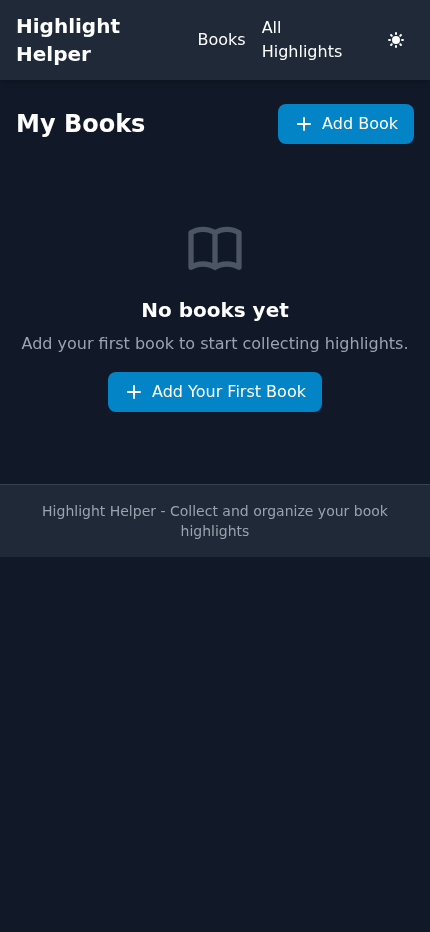
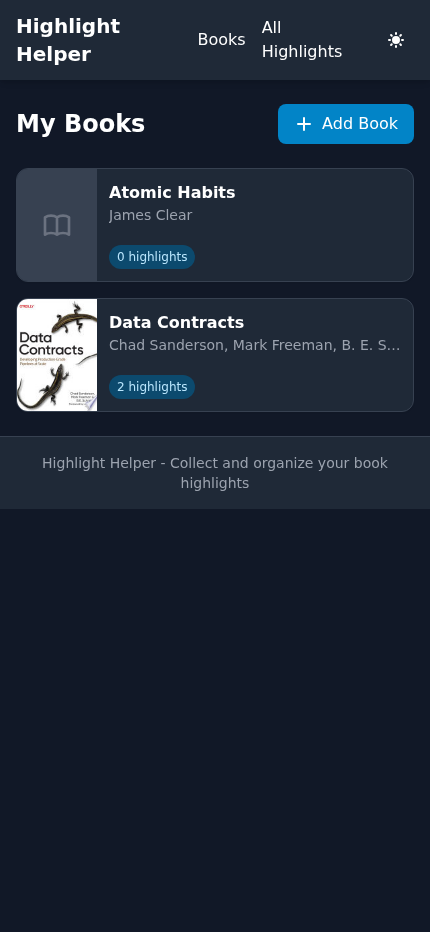
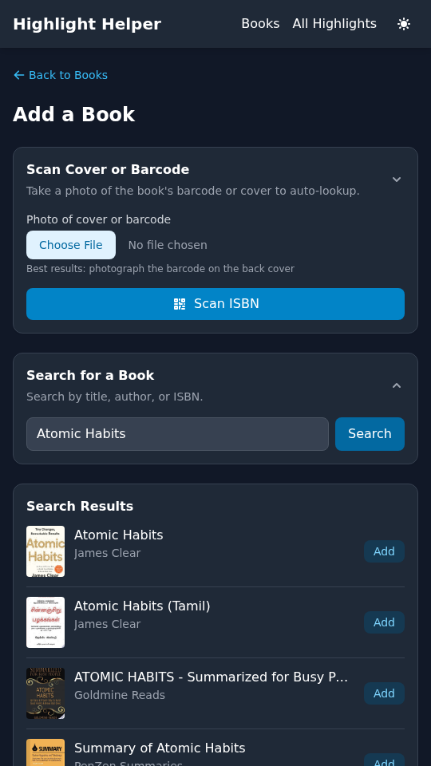
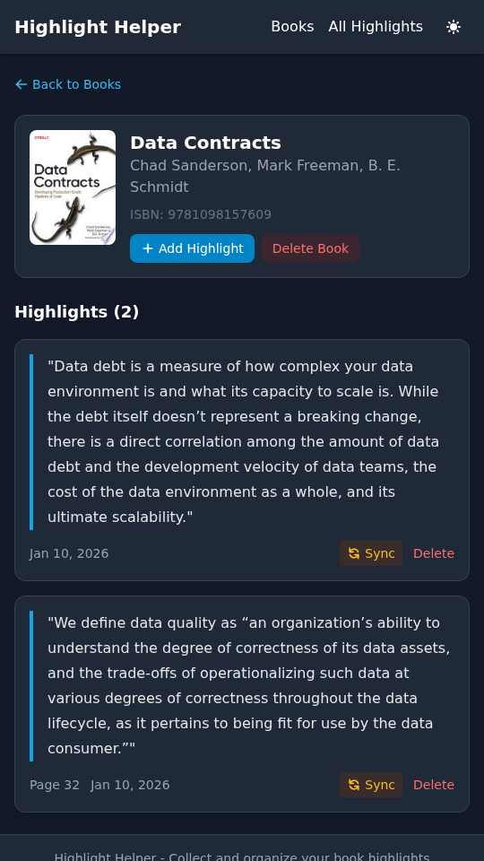
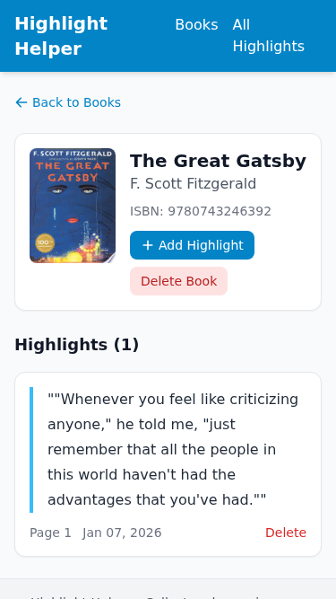
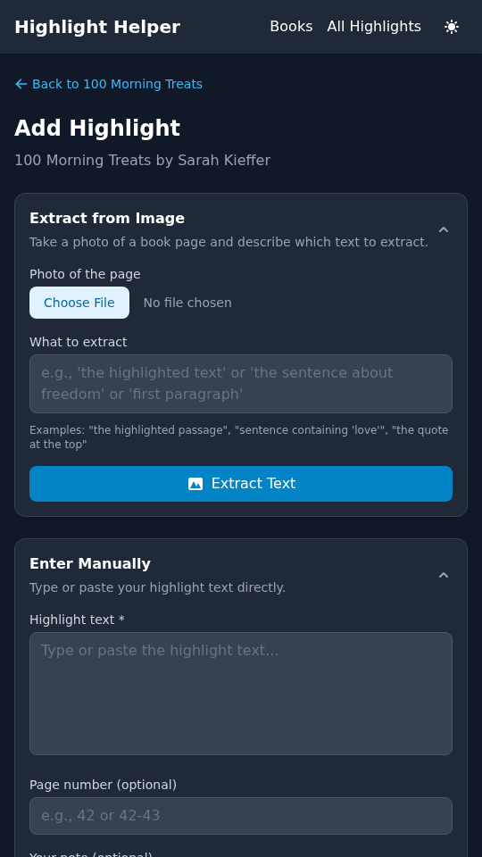
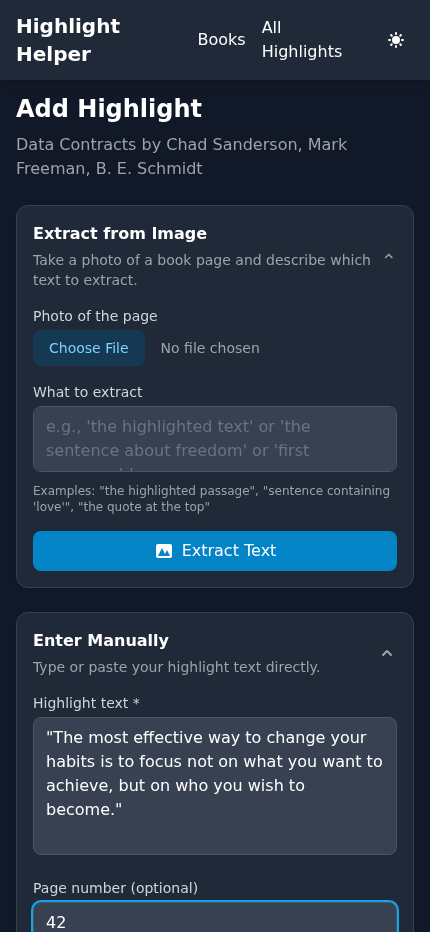
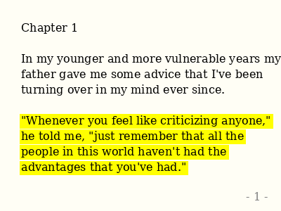
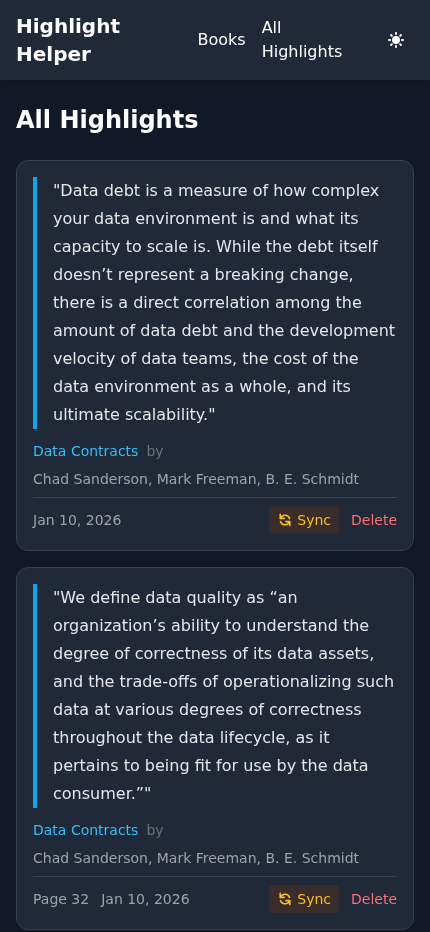

# Highlight Helper

A mobile-friendly web application for collecting and organizing book highlights using AI-powered image recognition.

[](https://github.com/EvanOman/highlight-helper/actions/workflows/ci.yml)

## Overview

Highlight Helper makes it easy to capture and organize meaningful passages from your physical books. Simply take a photo of a highlighted page, and the app uses OpenAI's Vision API to extract the text automatically. No more tedious manual typing!

### Key Features

- **AI-Powered Text Extraction**: Take a photo of a book page with highlighted text, and let GPT-4 Vision extract it for you
- **Book Library Management**: Search and add books from Google Books API with automatic cover art and metadata
- **Mobile-First Design**: Built for phones and tablets with a responsive, touch-friendly interface
- **Highlight Organization**: View all your highlights in one place, organized by book
- **Local Database**: All your data is stored locally in SQLite - your highlights stay private

## Screenshots

### Home Screen

The home screen shows all your books with highlight counts. Empty state guides new users to add their first book.

<p align="center">
  
  
</p>

### Book Search

Search for books using the Google Books API. Results include cover images, authors, and ISBNs.

<p align="center">
  
</p>

### Book Details

View a book's details and all its highlights. The cover image and metadata are pulled from Google Books.

<p align="center">
  
  
</p>

### AI-Powered Highlight Extraction

The magic happens here! Upload a photo of a book page, describe what to extract, and the AI does the rest.

<p align="center">
  
  
</p>

**Example of extracted text from a highlighted book page:**

<p align="center">
  
</p>

The AI correctly identifies the yellow-highlighted text and extracts it with high confidence, even detecting the page number!

### All Highlights View

Browse all your highlights across all books in one convenient list.

<p align="center">
  
</p>

## Technology Stack

- **Backend**: [FastAPI](https://fastapi.tiangolo.com/) - Modern, fast Python web framework
- **Database**: [SQLite](https://sqlite.org/) with [SQLAlchemy](https://www.sqlalchemy.org/) ORM (async)
- **Frontend**: Server-side rendered HTML with [Jinja2](https://jinja.palletsprojects.com/) + [Tailwind CSS](https://tailwindcss.com/)
- **AI**: [OpenAI GPT-4 Vision](https://platform.openai.com/docs/guides/vision) for text extraction
- **Book Data**: [Google Books API](https://developers.google.com/books) for book search and metadata

## Getting Started

### Prerequisites

- Python 3.10+
- An OpenAI API key (for highlight extraction)

### Installation

1. Clone the repository:
   ```bash
   git clone https://github.com/EvanOman/highlight-helper.git
   cd highlight-helper
   ```

2. Create a virtual environment and install dependencies:
   ```bash
   python -m venv venv
   source venv/bin/activate  # On Windows: venv\Scripts\activate
   pip install -e ".[dev]"
   ```

3. Set up environment variables:
   ```bash
   cp .env.example .env
   # Edit .env and add your OPENAI_API_KEY
   ```

4. Run the application:
   ```bash
   python -m uvicorn app.main:app --host 0.0.0.0 --port 8000
   ```

5. Open http://localhost:8000 in your browser (works great on mobile!)

## Development

### Running Tests

```bash
# Run all unit and integration tests
pytest tests/unit tests/integration -v

# Run with coverage
pytest tests/unit tests/integration --cov=app --cov-report=html

# Run E2E tests (requires Playwright)
playwright install chromium
pytest tests/e2e -v
```

### Code Quality

```bash
# Lint with Ruff
ruff check .

# Format with Ruff
ruff format .
```

## Project Structure

```
highlight_helper/
├── app/
│   ├── api/              # API routes (books, highlights, views)
│   ├── core/             # Configuration and database setup
│   ├── models/           # SQLAlchemy database models
│   ├── services/         # External service integrations
│   │   ├── book_lookup.py      # Google Books API
│   │   └── highlight_extractor.py  # OpenAI Vision API
│   └── templates/        # Jinja2 HTML templates
├── tests/
│   ├── unit/             # Unit tests for models, schemas, services
│   ├── integration/      # Integration tests for API endpoints
│   └── e2e/              # End-to-end Playwright tests
├── docs/
│   └── screenshots/      # App screenshots for documentation
└── static/               # Static files (CSS, JS, images)
```

## API Documentation

When the app is running, visit:
- **Swagger UI**: http://localhost:8000/docs
- **ReDoc**: http://localhost:8000/redoc

## Future Enhancements

- [ ] Export highlights to various formats (Markdown, CSV, Notion)
- [ ] Full-text search across all highlights
- [ ] Tags and categories for organizing highlights
- [ ] Share highlights with others
- [x] Dark mode support (with system preference detection)
- [ ] PWA support for offline access
- [ ] Sync across devices

## Contributing

Contributions are welcome! Please feel free to submit a Pull Request.

## License

This project is open source and available under the [MIT License](LICENSE).

## Acknowledgments

- [OpenAI](https://openai.com/) for the powerful Vision API
- [Google Books](https://books.google.com/) for the book search API
- [Tailwind CSS](https://tailwindcss.com/) for the beautiful styling
- [FastAPI](https://fastapi.tiangolo.com/) for the excellent web framework
