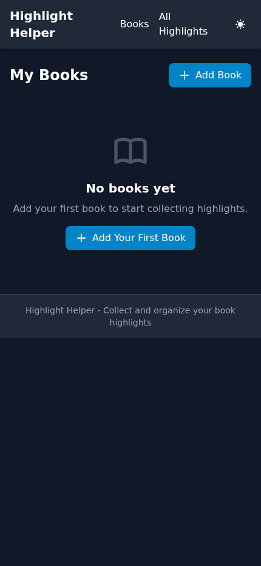
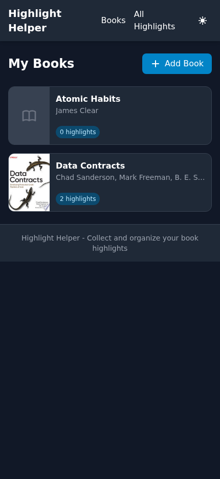
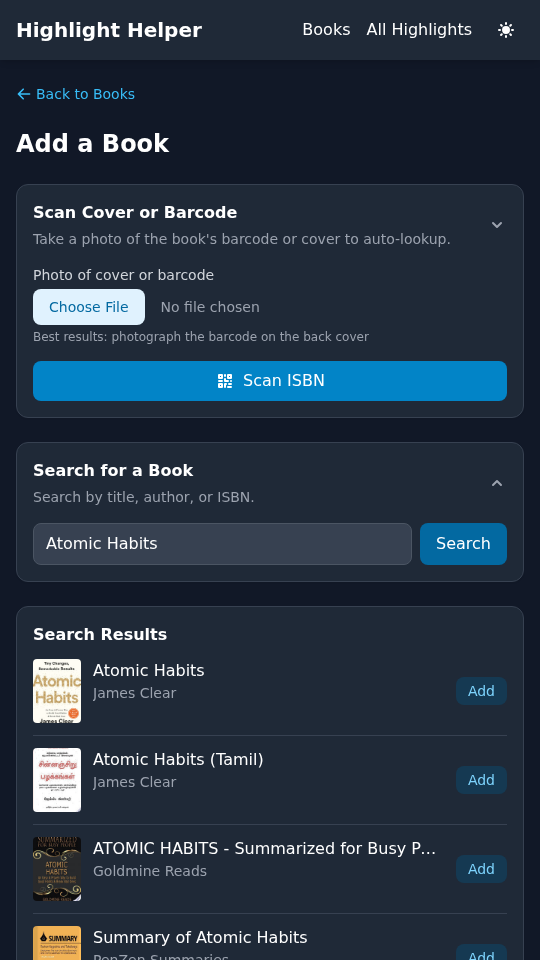
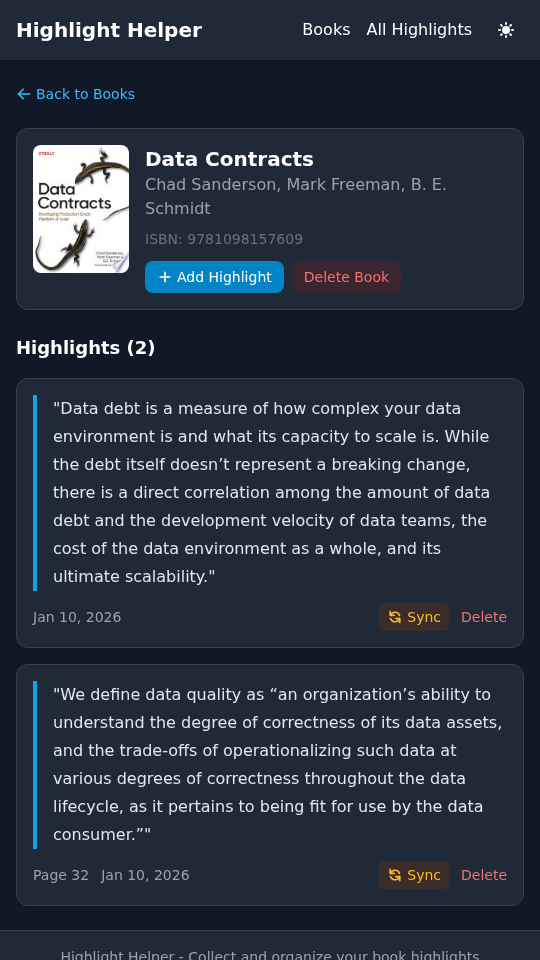
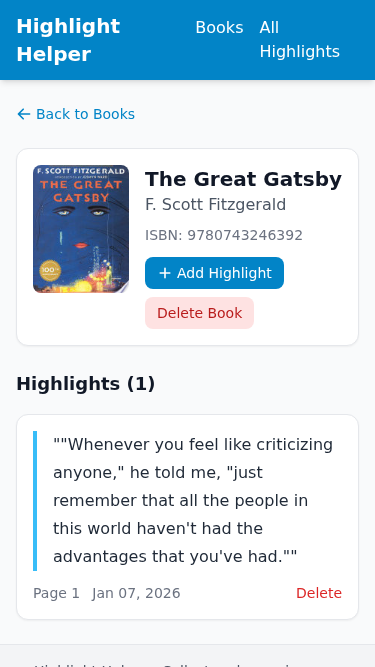
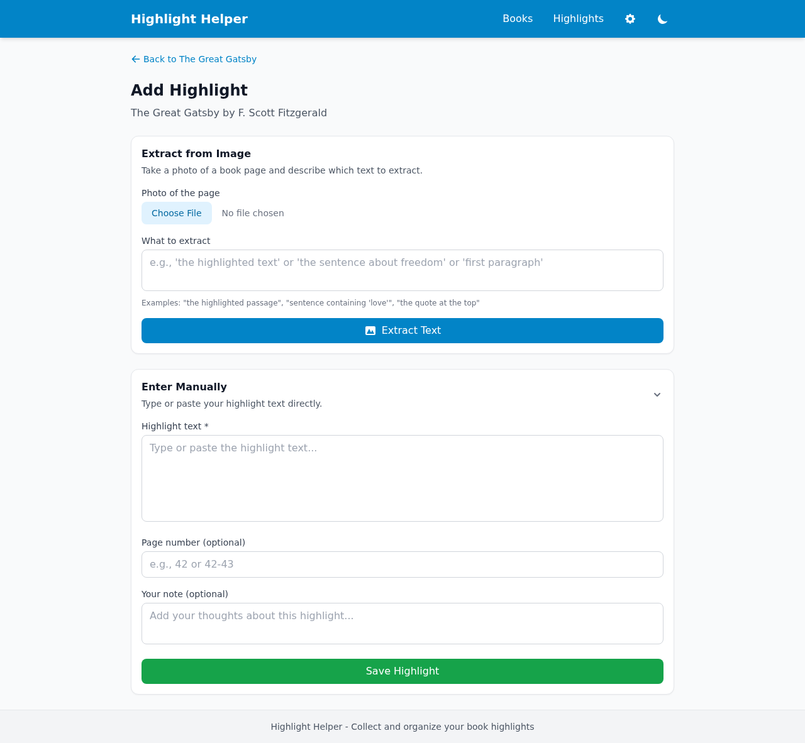
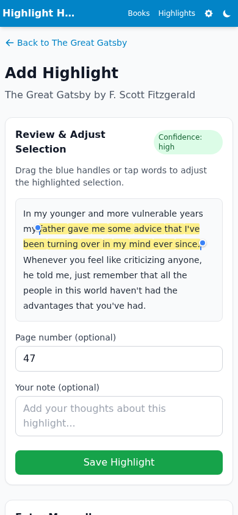
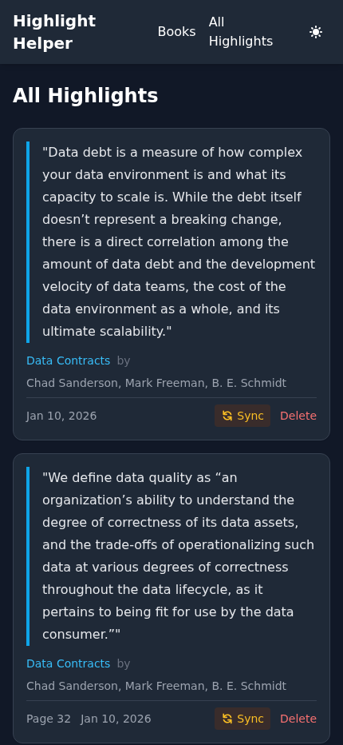

# Highlight Helper

A mobile-friendly web app for collecting and organizing book highlights using AI-powered text extraction.

[](https://github.com/EvanOman/highlight-helper/actions/workflows/ci.yml)

## Overview

Highlight Helper captures and organizes passages from physical books. Take a photo of a highlighted page, and the app uses OpenAI's Vision API to extract the text, returning both the full page content and the highlighted portion. An interactive editor lets you review and adjust the selection before saving.

### Key Features

- **AI-Powered Text Extraction** — Upload a photo of a book page, and the Vision API extracts all readable text along with the highlighted portion
- **Interactive Highlight Editor** — Review the full extracted text with the highlight marked, then drag handles to adjust the selection as needed
- **Book Library Management** — Search and add books via Google Books API with cover art and metadata
- **Mobile-First Design** — Responsive, touch-friendly interface designed for phones and tablets
- **Highlight Organization** — View all highlights in one place, organized by book
- **Readwise Sync** — Sync highlights to Readwise for integration with your reading workflow
- **Local Database** — Data stored in SQLite; highlights stay on your server

## Screenshots

### Home Screen

Books with highlight counts. Empty state directs users to add their first book.

<p align="center">
  
  
</p>

### Book Search

Search for books using the Google Books API. Results include cover images, authors, and ISBNs.

<p align="center">
  
</p>

### Book Details

View a book's details and all its highlights.

<p align="center">
  
  
</p>

### Highlight Extraction

Upload a photo of a book page, provide optional instructions (e.g. "extract highlighted text"), and the AI extracts the full page text with the highlighted portion identified.

<p align="center">
  
</p>

After extraction, the editor displays the full page text with the highlighted selection marked in yellow. Drag the handles or tap words to adjust the selection before saving.

<p align="center">
  
</p>

### All Highlights View

Browse all highlights across all books in one list.

<p align="center">
  
</p>

## Technology Stack

- **Backend**: [FastAPI](https://fastapi.tiangolo.com/) with async SQLAlchemy
- **Database**: [SQLite](https://sqlite.org/) via [SQLAlchemy](https://www.sqlalchemy.org/) (async)
- **Frontend**: Server-rendered HTML with [Jinja2](https://jinja.palletsprojects.com/) + [Tailwind CSS](https://tailwindcss.com/)
- **AI**: [OpenAI Vision API](https://platform.openai.com/docs/guides/vision) via [DSPy](https://dspy.ai/)
- **Book Data**: [Google Books API](https://developers.google.com/books)
- **Readwise**: [readwise-plus](https://pypi.org/project/readwise-plus/) SDK

## Getting Started

### Prerequisites

- Python 3.10+
- An OpenAI API key (for highlight extraction)

### Installation

1. Clone the repository:
   ```bash
   git clone https://github.com/EvanOman/highlight-helper.git
   cd highlight-helper
   ```

2. Create a virtual environment and install dependencies:
   ```bash
   python -m venv venv
   source venv/bin/activate  # On Windows: venv\Scripts\activate
   pip install -e ".[dev]"
   ```

3. Set up environment variables:
   ```bash
   cp .env.example .env
   # Edit .env and add your OPENAI_API_KEY
   ```

4. Run the application:
   ```bash
   python -m uvicorn app.main:app --host 0.0.0.0 --port 8000
   ```

5. Open http://localhost:8000 in your browser

## Development

### Running Tests

```bash
# Run all unit and integration tests
pytest tests/unit tests/integration -v

# Run with coverage
pytest tests/unit tests/integration --cov=app --cov-report=html

# Run E2E tests (requires Playwright)
playwright install chromium
pytest tests/e2e -v
```

### Code Quality

```bash
# Lint with Ruff
ruff check .

# Format with Ruff
ruff format .
```

## Project Structure

```
highlight_helper/
├── app/
│   ├── api/              # API routes (books, highlights, views)
│   ├── core/             # Configuration and database setup
│   ├── models/           # SQLAlchemy database models
│   ├── services/         # External service integrations
│   │   ├── book_lookup.py         # Google Books API
│   │   ├── highlight_extractor.py # OpenAI Vision API via DSPy
│   │   ├── text_matching.py       # Fuzzy text matching for highlight offsets
│   │   └── readwise.py            # Readwise sync
│   └── templates/        # Jinja2 HTML templates
├── tests/
│   ├── unit/             # Unit tests for models, schemas, services
│   ├── integration/      # Integration tests for API endpoints
│   └── e2e/              # End-to-end Playwright tests
├── docs/
│   └── screenshots/      # App screenshots
└── static/
    └── js/
        └── highlight-editor.js  # Interactive word-level highlight editor
```

## API Documentation

When the app is running, visit:
- **Swagger UI**: http://localhost:8000/docs
- **ReDoc**: http://localhost:8000/redoc

## Future Enhancements

- [ ] Export highlights to various formats (Markdown, CSV, Notion)
- [ ] Full-text search across all highlights
- [ ] Tags and categories for organizing highlights
- [x] Dark mode support (with system preference detection)
- [ ] PWA support for offline access

## Contributing

Contributions welcome. Feel free to open a Pull Request.

## License

This project is available under the [MIT License](LICENSE).
