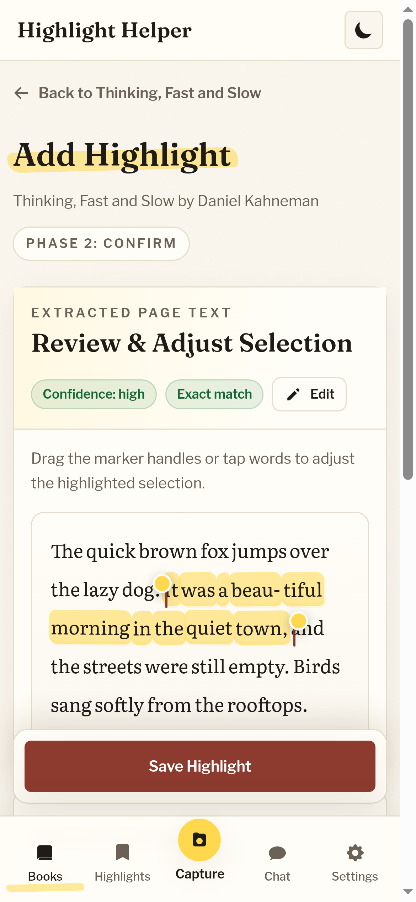
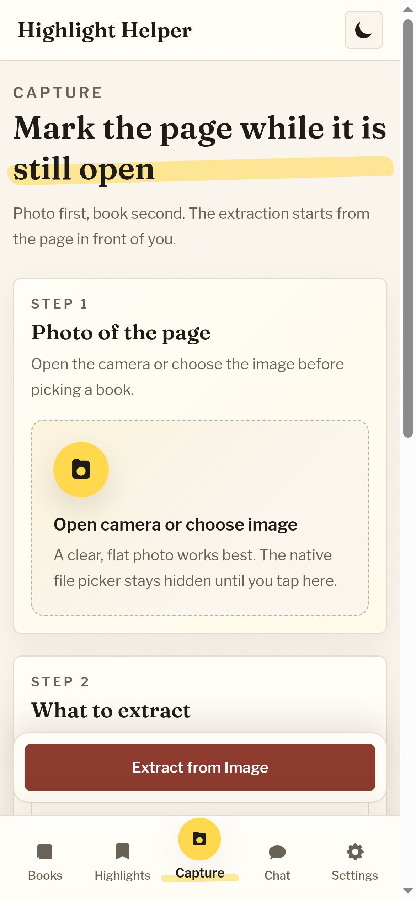
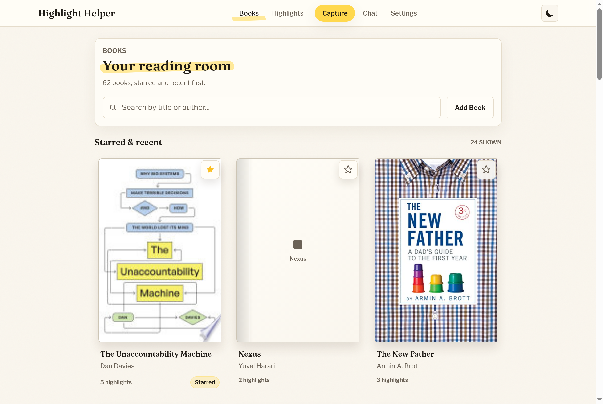
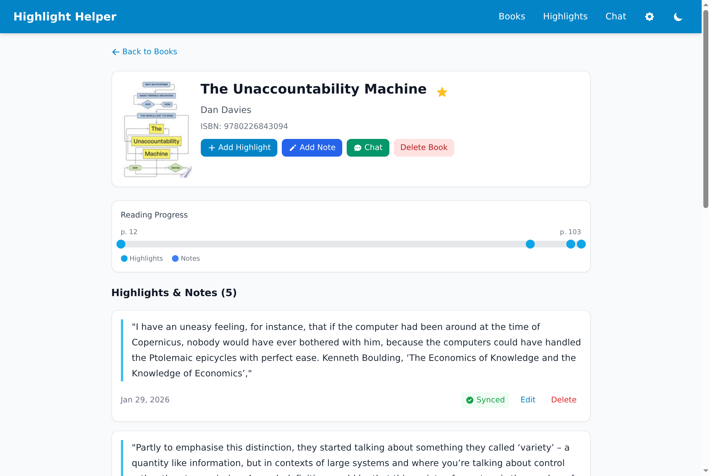
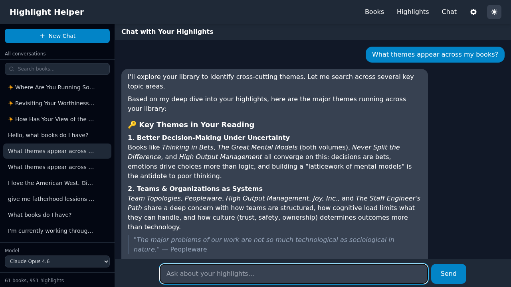
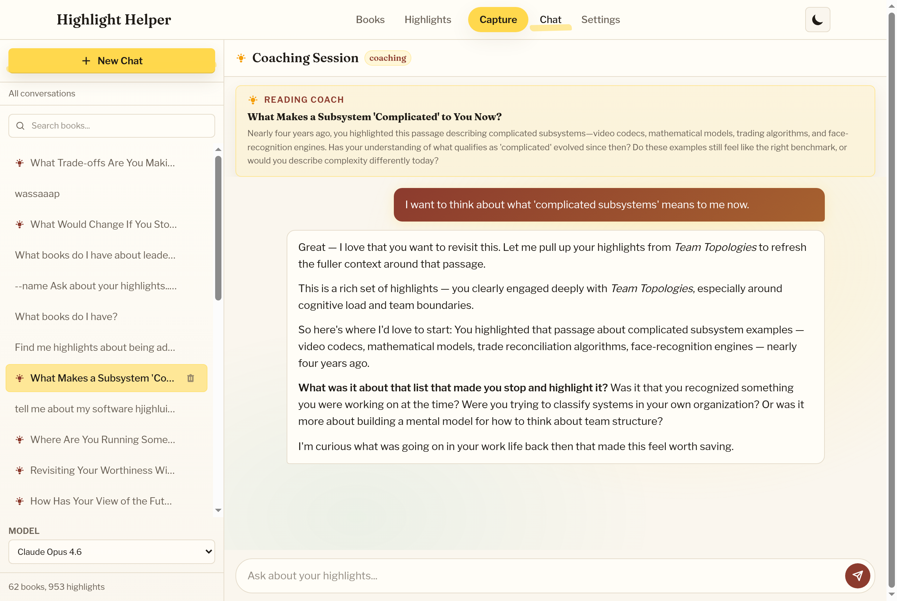

# Highlight Helper

[](https://github.com/EvanOman/highlight-helper/actions/workflows/ci.yml)
[](https://codecov.io/gh/EvanOman/highlight-helper)

Photograph a marked-up book page; get the exact highlighted passage back, verbatim, ready to save and sync to Readwise.

Highlight Helper is a mobile-first web app for capturing highlights from physical books. Take a photo of a page you've marked with a highlighter or pen, and a vision model transcribes the page, finds the marked passage, and drops you into an editor where the selection is already made — adjusting it is usually a confirmation, not a repair job.



## The core loop

Capture is one thumb-tap from anywhere: the mobile bottom bar's center button opens a photo-first flow — pick the page while the book is still open, then tell it which book.



1. **Snap a photo** of the page (photos are downscaled client-side before upload, so it's fast on a phone).
2. **The vision pipeline** (OpenAI via DSPy) transcribes the full page, identifies the highlighted/underlined/marked portion — or follows a natural-language instruction like *"the sentence about trade-offs"* — and locates its exact character span in the page text.
3. **Review in the editor**: the passage is pre-selected over the full page text. Drag the handles or tap words to adjust. Page numbers are auto-detected.
4. **Save** — the stored text is the exact character slice of the page (hyphenated line-breaks rejoined), never a paraphrase or a reflow.
5. **Readwise sync** pushes it into the rest of your reading workflow automatically.

### Honest by design

The pipeline never fakes a result:

- If the photo can't be read, you get an explicit error — with your instructions preserved and a manual-entry fallback — not a silent reset.
- If the page was transcribed but the marked passage couldn't be located, the editor opens with **nothing selected** and says so; Save stays disabled until you pick the passage yourself. A failed match is never dressed up as a full-page "selection".
- The confidence badge is tied to *match quality*, not just model self-assessment: only a verbatim exact match earns green.
- Got a bad extraction? **Re-extract with edited instructions, no re-upload** — the photo is kept server-side for the session.

## Extraction quality is measured, not vibes

The repo ships an eval harness (`evals/`) that renders photo-realistic book pages with *actual visual highlights* — marker strokes, pen underlines, margin brackets — over known ground truth, then degrades them (perspective warp, rotation, glare, shadows, blur, desk backgrounds) and scores the full pipeline on every change:

| Metric (48-case synthetic set) | Score |
|---|---|
| Highlight token F1 | **97.3%** |
| Char-span IoU | 98.1% |
| Verbatim rate (after repair) | 100% |
| Hallucinations on unmarked pages | **0** |
| Page-number accuracy | 100% |
| p50 latency / cost | ~4s / ~$0.01 per extraction |

Three data tiers keep the numbers honest:

- **Synthetic + augmented** (`just eval`, `just eval-augment`): deterministic generated pages, plus phone-photo-style augmentations (±15° rotation, keystone, glare, cluttered backgrounds) that probe where the pipeline breaks.
- **Real public-domain holdout** (`just eval-real`): labeled photographs of real book pages from Internet Archive scans, with per-image attribution (`evals/samples/real/ATTRIBUTION.md`).
- **Your own uploads**: every photo that flows through extraction is retained (locally, flag-controlled) with a JSON sidecar of the full extraction outcome, and `scripts/promote_upload.py` turns any of them into a labeled eval case.

Reports land in `evals/reports/`; consequential design decisions are recorded in `docs/decisions/`.

## Beyond capture

### Library

Search and add books via Google Books, with covers, reading-progress timelines, and per-book highlight lists.





### Chat with your highlights

Ask questions across your whole library; the assistant searches your actual highlights and quotes them back with sources.



### AI reading coach

Proactively generated coaching cards resurface old passages and open Socratic sessions grounded in what you actually saved.



## Limitations & security model

- Designed for **single-user** operation.
- Intended deployment is over a **private Tailscale network** to your own machine.
- It does **not** implement production-grade multi-user security (auth hardening, CSRF, per-user isolation, rate limiting). Treat it as personal software unless hardened.
- Uploaded page photos are retained locally under `data/uploads/` for eval mining; set `STORE_UPLOADED_IMAGES=false` to disable.

## Technology

- **Backend**: [FastAPI](https://fastapi.tiangolo.com/) + async [SQLAlchemy](https://www.sqlalchemy.org/) on SQLite, migrations via Alembic
- **Frontend**: server-rendered Jinja2 + [Tailwind CSS](https://tailwindcss.com/), vanilla-JS highlight editor
- **Vision/AI**: OpenAI via [DSPy](https://dspy.ai/), with an optional Groq fallback; deterministic fake LLM (`FAKE_LLM=1`) for zero-cost full-stack tests
- **Books**: [Google Books API](https://developers.google.com/books) · **Sync**: [readwise-plus](https://pypi.org/project/readwise-plus/)

## Getting started

Requires Python 3.12+, [uv](https://docs.astral.sh/uv/), and [just](https://github.com/casey/just).

```bash
git clone https://github.com/EvanOman/highlight-helper.git
cd highlight-helper
just install                 # uv sync --dev
cp .env.example .env         # add your OPENAI_API_KEY
just dev                     # http://localhost:18742
```

## Development

```bash
just fc            # format, lint, contract checks, type-check, unit+integration tests
just test-e2e      # Playwright E2E suite (temp DB, port 8765)
just selftest      # full-stack chat self-test in a real browser (FAKE_LLM, no API cost)

just eval          # run extraction evals online against the current pipeline
just eval-offline  # replay from cache (no API cost)
just eval-real     # score the real-photo holdout separately
just uploads-stats # size of the retained-upload corpus

just redeploy      # rebuild Docker, restart, health-check, smoke-test
```

`just fc && just test-e2e` matches CI. The eval harness is pluggable (`--pipeline`) so pipeline changes ship with a before/after comparison — see `docs/decisions/` for the running decision log.

## Project structure

```
highlight_helper/
├── app/
│   ├── api/               # REST API + server-rendered views
│   ├── core/              # Config, DB setup, telemetry
│   ├── models/            # SQLAlchemy models
│   ├── repositories/      # DB access layer
│   ├── services/          # Extraction pipeline, text matching, image prep,
│   │                      #   upload archive, Readwise, chat, coaching
│   └── templates/         # Jinja2 templates
├── evals/                 # Eval harness: dataset generator, augmentation,
│   ├── samples/           #   synthetic + augmented cases
│   └── samples/real/      #   labeled public-domain holdout (+ attribution)
├── docs/decisions/        # Versioned decision log
├── alembic/               # Schema migrations
├── scripts/               # smoke checks, upload promotion, backups
├── static/js/highlight-editor.js   # Interactive selection editor
└── tests/                 # unit / integration / e2e (Playwright)
```

## API documentation

With the app running: **Swagger UI** at `/docs`, **ReDoc** at `/redoc`.

## License

[MIT](LICENSE)
